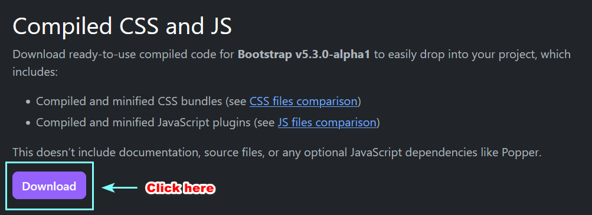
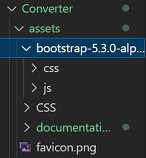

# How to install bootstrap in local
## Download

First you need to download the directory which conatins CSS and JS of the framework. 
To do this go on [Bootstrap site](https://getbootstrap.com/docs/5.3/getting-started/download/ "link to download").

Then click on

Now you will have a zip file. 

## Install Bootstrap in the project

Extract the zip file and put the two directory (CSS and JS) in your project. 

For example : 

Here in my project, I created a directory assets then another directory named bootstrap, finally I placed my two files extract from the zip file.

Finally you need to add the link in your HTML 